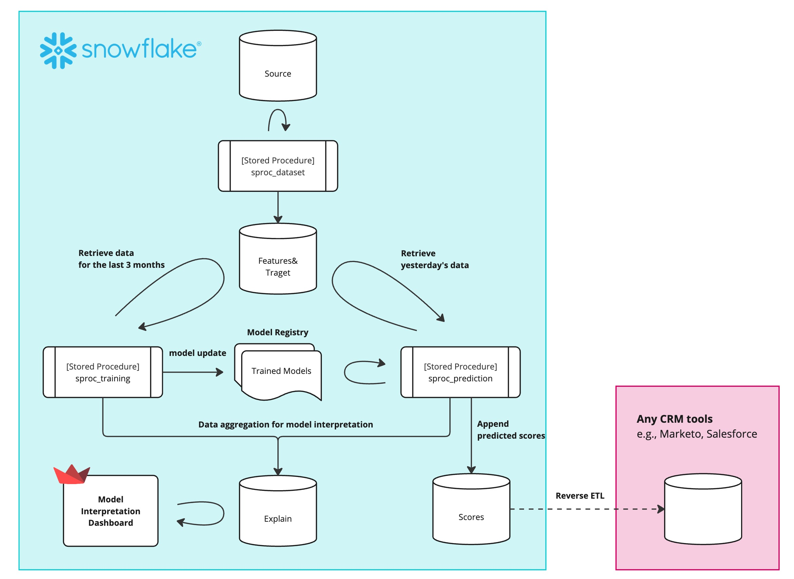

# Snowflake ML System Sandbox

## Overview

This repository serves as a personal sandbox for exploring and staying up-to-date with Snowflake's latest machine learning features. The primary focus is on implementing practical use cases to deepen understanding and evaluate the integration of Snowflake’s capabilities with Python-based workflows. Specifically, this sandbox demonstrates predicting and scoring customer purchasing intent in an online shopping context, storing these scores in Snowflake for downstream marketing applications.


## Usecase

The system predicts customer purchasing intent based on session data from an online shopping platform. The daily batch processing pipeline:
- Computes purchasing intent scores for each user.
- Stores the scores in the Scores table in Snowflake.

This setup simulates a marketing pipeline, enabling targeted campaigns based on intent scores.

## ML Sysmtem Details 



### Data Flow

#### Data Source
The dataset used is a modified version of the [Online Shoppers Purchasing Intention Dataset](https://archive.ics.uci.edu/dataset/468/online+shoppers+purchasing+intention+dataset) from the UCI Machine Learning Repository. Modifications include:
- `SessionDate`: Derived from the Month column and formatted as 2024-xx-01.
- `UID`: Generated using UUIDs.

By combining SessionDate and UID, each record in the dataset is uniquely identifiable. 

#### Data pipeline

1. Source Table (source)
    - Stores raw data
2. Dataset Table (dataset)
    - Stores processed data for machine learning
    - Contains feature-engineered data
3. Scores Table (scores)
    - Stores prediction results
    - Contains UID, session date, model name, model version, and scores

### Model Training Process 

#### Challenger Model Generation (sproc_training)
- Execution: 1st day of every month at 10:00 AM (JST)
- Process Details:
    - Model Training: Uses the last 3 months of data as train/val dataset
    - Feature and hyperparameter search space configurations are managed in `src/config.yml`

#### Model Evaluation & Update (sproc_model_evaluation)
- Execution: 15th day of every month at 10:00 AM (JST)
- Process Details:
    - Model Evaluation: Uses the last 2 weeks of data (2 weeks after challenger model generation) as test dataset
    - Model Update: Updates the production model if the challenger model outperforms the champion model

#### Model Rollback
- Command: `make rollback version=<version_name>`
- Process Details:
    - Rolls back the model to the specified version
    - Version name format: `v_YYMMDD_HHMMSS` (e.g., `v_250130_121116`)


### Model Inference Process 
- Execution: Daily at 8:00 AM (JST)
- Process Details: Predicts purchase intent scores for the previous day's data

## Technical Stack

- Programming Language: Python 3.11
- Dependency Management: Poetry
- Continuous Integration: GitHub Actions
- Snowflake Features:
    - Snowpark for Python: A development framework to execute Python directly within Snowflake’s processing engine. 
    - Python Stored Procedures: Wrapping and deploying processing logic.
    - Model Registry: Managing machine learning models.
    - Task Scheduling: Automating daily score computations.
    - Streamlit in Snowflake: Visualizing model explainability (Planned).
    - Model Explainability: Support for calculating shaplay values (Planned).
    - Model Observability: Tracking model performance health (Planned).

## Development Environment

### Code Quality Management
- Ruff: Linting and formatting.
- Mypy: Static type checking.
- Pytest: Testing.

### Development Commands

A Makefile is provided for streamlined development tasks:
- `make lint`: Run linter to check code quality.
- `make format`: Run formatter to ensure consistent code style.
- `make test`: Run tests using pytest.
- `make deploy-sproc`: Deploy stored procedures.
- `make deploy-task`: Deploy tasks.

## Setup

1. Set Up Python Environment:
```bash
poetry install
```

2. Configure Snowflake:
- Create a file named connection_parameters_dev.json, connection_parameters_prod.json in the root directory with the following structure:
  ```json
  {
    "account": "",
    "user": "",
    "password": "",
    "role": "",
    "warehouse": "",
    "database": "", 
    "schema": ""
  }
  ```
  - Fill in the necessary connection details specific to your Snowflake account.
    - For `connection_parameters_dev.json`, specify the development database name (`mlsystem_dev`).
    - For `connection_parameters_prod.json`, specify the production database name (`mlsystem_prod`).


3. Prepare and Upload Dataset
- Run the following command to preprocess the dataset and upload it to Snowflake:
  ```bash
  make setup
  ```

4. Set Up Event Logging (Optional)
- If you haven't configured an event table for Snowflake logging, execute the following SQL commands:
  ```sql
  CREATE EVENT TABLE <your_event_table_name>;
  ALTER ACCOUNT SET EVENT_TABLE = <your_database_name>.<your_schema_name>.<your_event_table_name>;
  ```

5. Deploy Stored Procedures and Tasks
- Run the following commands to deploy stored procedures and tasks:
  ```bash
  make deploy-sproc
  make deploy-task
  ```
  Note: Tasks are automatically resumed during deployment. If you need to suspend them, please configure this separately through the Snowflake GUI.